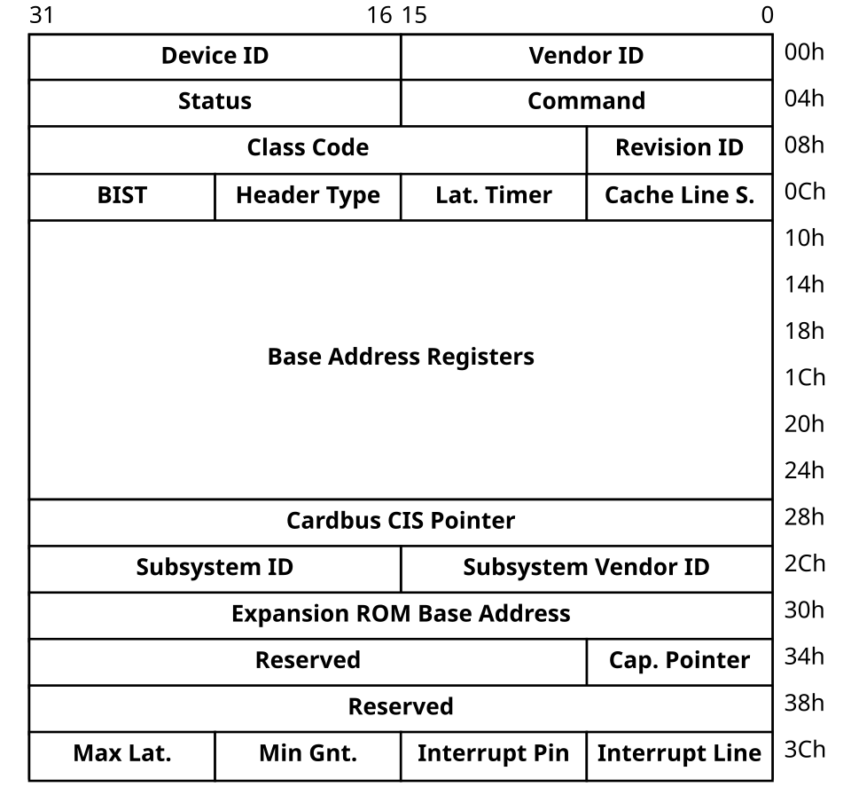
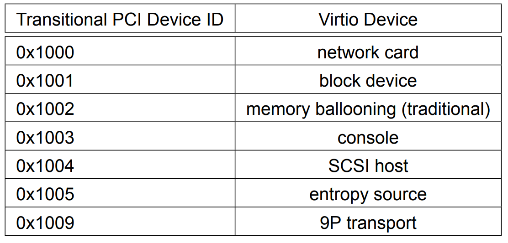
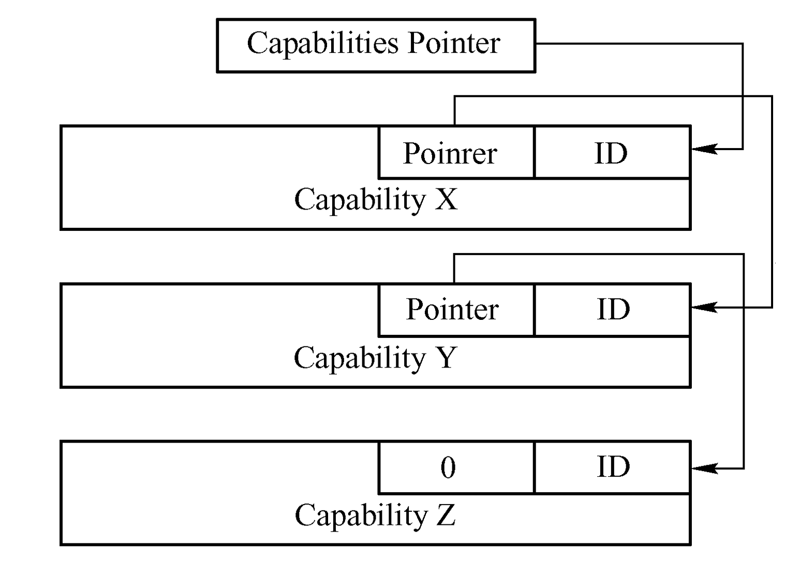
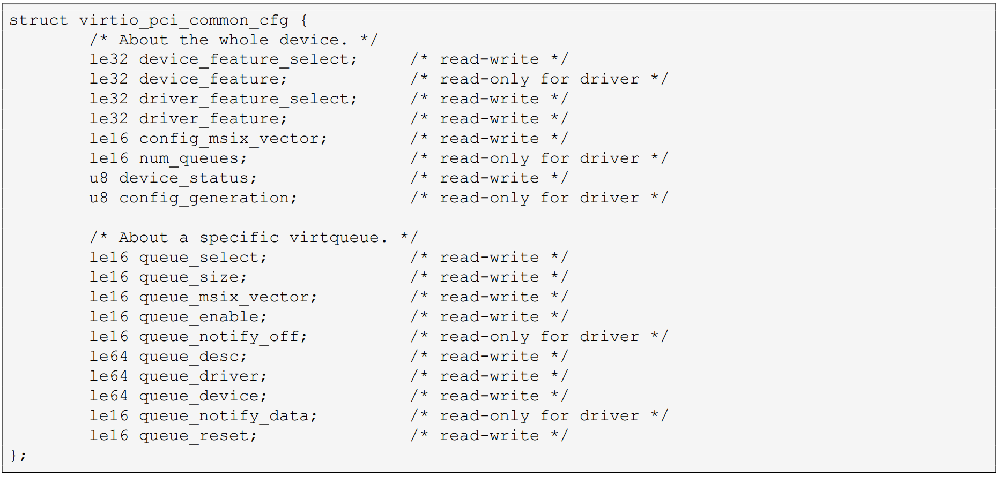
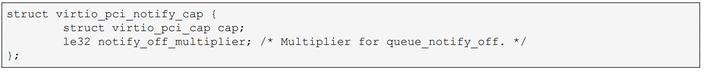
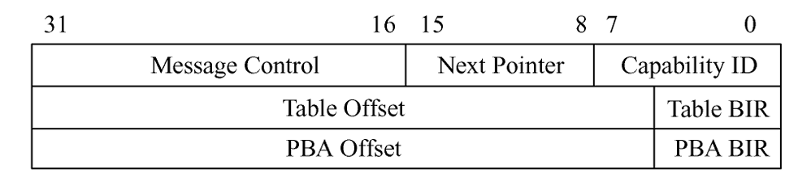
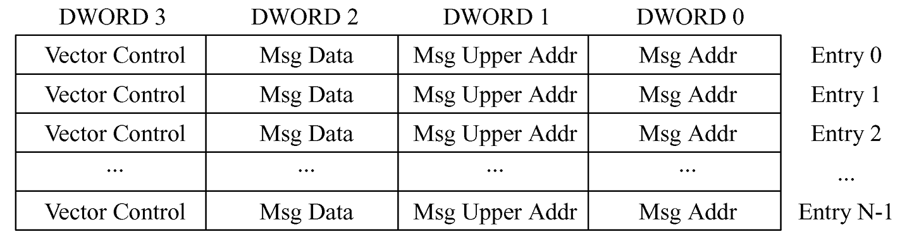
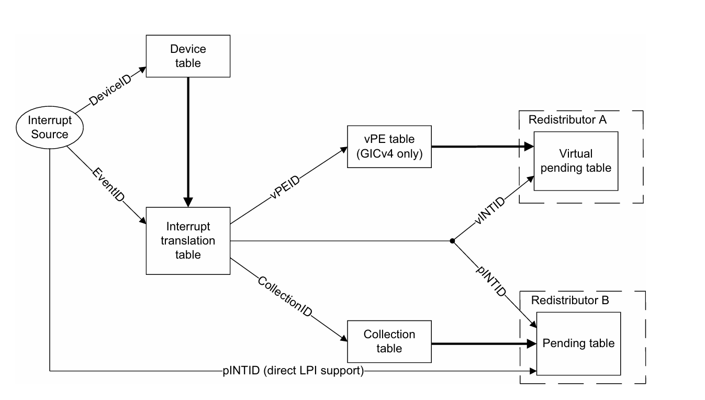
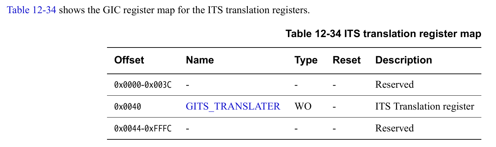

# 在hvisor中支持模拟Virtio PCI设备

时间：2026/03/30

作者：曾俊

## Virtio Transport Options

Virtio协议使用不同的总线进行数据传输，目前一共支持三种传输选项：

1. Virtio over PCI
2. Virtio over MMIO
3. Virtio over Channel IO

其中MMIO传输在hvisor中已经实现，而Channel IO是Virtio协议为不支持PCI和MMIO的，基于S/390的虚拟机特别支持的数据传输方式

在一般的架构以及linux内核中，Virtio PCI是Virtio最为常见的数据传输协议

当前hvisor可以在qemu中将一个Virtio-PCI设备直通给root linux，当然也可以通过配置将Virtio-PCI设备直通给non root linux
它的本质是qemu实现了功能完整的Virtio设备，当它以适当的接口暴露给linux的PCI驱动时，linux自然可以枚举并挂载这些Virtio设备

如果是在物理设备，那么物理平台上是不存在Virtio设备的，所以non root linux是不能使用Virtio PCI设备的，这需要hvisor模拟一个Virtio PCI设备才能实现

Hvisor对于设备虚拟化的路线是：hvisor向non root linux暴露一些虚拟设备（一般是Virtio设备，比如virtio-rng），当non root linux访问这些设备时，hvisor会捕获这些访问，并将这些请求发送给root linux，由root linux完成请求再通知non root linux

所以当前工作主要是为了实现hvisor**向non root linux提供virtio-pci设备的框架**

## Hvisor向本工作提供了什么抽象

参见仓库：<https://github.com/syswonder/hvisor/blob/dev/src/pci/vpci_dev/mod.rs>

hvisor的PCI虚拟化工作已经解决了PCI协议相关的工作，为本工作提供了一个干净的抽象
为了在虚拟的PCI总线中暴露一个设备，你需要：

1. 完成一个read_cfg函数，它用于读取虚拟PCI设备的配置空间
2. 完成一个write_cfg函数，它用于修改虚拟PCI设备的配置空间
3. 完成一个vdev_init函数，它用于虚拟PCI设备初步初始化

下面是PCI设备的配置空间示意图：



### PCI设备配置空间

这里介绍一些和virtio相关的概念

**Device ID**和**Vender ID**，PCI协议使用这两个字段来唯一识别设备

比如说：VGA compatible controller: Intel Corporation Raptor Lake-S UHD Graphics 这个设备，它的vender id为1E0F，device id为001A

在PCI协议中，所有的Virtio设备的vender id都为0x1AF4，而device id则由Virtio协议规定，可参考下图：



上图是传统的Virtio设备ID，现代的Virtio设备ID一般是从0x1041开始，比如network card在上图中是第一个设备，那么它的现代设备ID就是0x1041,而entropy source是第六个，那么它的现代设备ID就是0x1046,以此类推

---
**Base Address Register**，简称为BAR寄存器，是PCI协议重要的申请资源方式

实际上PCI设备的配置空间的大小是非常有限的，如果要支撑起设备大量的数据传输，仅仅依靠配置空间是完全不够的
有些设备需要更多的配置，就连这些设备自身的特殊配置，PCI配置空间也完成不了
设想一下，操纵设备对于内核而言，很多情况下就是操纵寄存器，设备将自己的功能以寄存器的形式暴露给内核，内核只需要读写这些寄存器就可以实现操纵设备
实际上直观的想法是，设备告诉内核“我的A寄存器在地址x1，我的B寄存器在地址x2...”，但是内核是内存空间的管理者，它不能允许设备自行分配地址
所以PCI协议提供了BAR寄存器

首先设备需要思考自己需要多少地址空间来映射自己的寄存器，比如说设备A需要一块大小为0x1000和一块大小为0x8000的地址空间来映射自己的寄存器，那么它可以分别在两个BAR寄存器中声明自己所需要的地址空间大小（具体如何声明这里不做介绍）

当内核枚举PCI设备时，内核会遍历配置空间的六个BAR寄存器，如果一个BAR寄存器中有地址空间需求的声明，那么内核会分配一段对应大小的地址空间，并把这个空间的地址写入BAR寄存器，此时内核和设备之间就建立了一块专属的地址空间用于它们之间的通讯。当内核访问这块地址空间时，硬件会将其转换为一个mmio请求发送给设备，设备收到请求之后就会做出对应的一些动作。

这块地址空间本质上就是内核指使设备：“我以后就通过这个地址空间访问你，当我读写这些地址时，就相当于读你的寄存器”

---
**Capabilities Pointer** and **Capability**

Capability是PCI协议的重要功能。上面我们提到，PCI设备可以通过BAR寄存器来向内核申请一块地址空间来建立内核地址空间和设备寄存器之间的映射，但是实际上只申请一块地址空间的话，内核对于这块地址空间的结构一无所知。

也就是说，内核只是拥有一个`void* device_space`指针，如何访问这个指针，指针里面是一个怎么样的数据结构，内核是不清楚的。

所以设备需要另一个方式来告诉内核**如何访问这个device_space**，于是就有了Capability这个功能

现代的PCIe协议的配置空间大小为0x1000，注意到上面展示的PCI配置空间只包括了前0x40大小的字段，而后面这么多的空间实际上是PCI协议没有定义的，这些空间实际上是用于放入Capabilities的

所以Capabilities是什么？Capabilities在程序员角度可以理解为一个链表数据结构，如下图所示：



内核通过位于0x34的Capabilities Pointer来找到capabilities链表的第一个节点，并遍历整个capabilities。

那内核如何解析capabilities呢？每一个capability都有一个ID来告知内核当前capability是什么类型的capability，比如说0x05表示当前capability是MSI capability，0x11表示当前capability是MSI-X capability

当内核知道当前的capability的类型，就知道如何解析capability了

Capabilities在设计者的角度可以看作是**对BAR如何使用的说明**（当然并不是所有Capabilities都是为了对BAR进行说明，有些Capabilities甚至不会使用BAR，但是大部分都是起到对BAR的说明作用）

比方说，我有一个PCI设备它控制着0x8000个LED灯，那么我就使用BAR1申请0x1000大小的地址空间，随后我会在Capability链表中加入一个LED Capability，声明这个Capability使用了BAR1的0x0000---0x1000这段地址空间（也可以有别的Capability同时使用BAR1申请的地址空间，所以例子中的LED Capability也有可能使用0x1000---0x2000这样的范围，这取决于设备设计者怎么设计），并且我告诉内核，每一个bit都表示一个LED灯，0表示灯亮，1表示灯灭。如此内核就知道如何通过写入`void* device_space`来控制LED灯的亮灭了

---
对于本工作而言，我们只需要了解上面所介绍的PCI设备配置空间内容，其余未介绍的字段对于Virtio-PCI的影响不大

## Virtio-PCI设备的配置

Virtio-PCI设备的配置主要通过Virtio协议设计的Capabilities完成，下面介绍Virtio-PCI设备的Capabilities

### Virtio Structure PCI Capabilities

从Capabilities的角度来看，Virtio只有一种Capability，也就是virtio_pci_cap：

``` c
#define VIRTIO_PCI_CAP_COMMON_CFG   1
#define VIRTIO_PCI_CAP_NOTIFY_CFG   2
#define VIRTIO_PCI_CAP_ISR_CFG      3
#define VIRTIO_PCI_CAP_DEVICE_CFG   4
#define VIRTIO_PCI_CAP_PCI_CFG      5
#define VIRTIO_PCI_CAP_SHARED_MEMORY_CFG    8
#define VIRTIO_PCI_CAP_VENDER_CFG   9

struct virtio_pci_cap{
    u8 cap_vndr;    // PCI Capability要求的字段，表示Capability ID
    u8 cap_next;    // 下一个PCI Capability位置的指针
    u8 cap_len;     // 当前Capability在配置空间中的长度
    u8 cap_type;    // Virtio Capability有多种类型，这个字段标识当前Capability是哪一类
    u8 bar;         // 当前Capability使用哪个bar
    u8 id;          // 同一个Virtio设备可能有多个相同类型的Capabilities，使用id来标识同一类型的不同Capabilities
    u8 padding[2];  // 用于保持alignment
    le32 offset;    // 在BAR地址中的offset
    le32 length;    // 在BAR地址中的length
}
```

也就是说，所有virtio协议设计的capabilities都是使用上面的结构

### Virtio common configuration

如果一个virtio_pci_cap的cap_type值为`VIRTIO_PCI_CAP_COMMON_CFG`,那么就表明这是一个common configuration capability
在这个capability使用的BAR地址空间中会有下面这个结构体：


common configuration承担了Virtio-PCI设备的大部分配置工作，下面是各字段的说明：

#### feature

首先是device feature，它表示设备能够支持的features，virtio目前为每一个设备支持64个feature位，设备在实现时可以自行决定完成哪些feature
其中比较关键的是VIRTIO_F_VERSION_1(32)，这个feature表示当前设备是现代virtio（而不是传统virtio），一般来说目前的virtio设备都会包含这个feature

而driver feature则表示驱动支持的features，驱动在读取common configuration的结构体时，会读取device feature，并和自己支持的features进行比较，一般会取两者的交集作为最终的features写入到driver feature，这个过程也叫feature negotiation。所以driver feature的语义是：driver在feature negotiation之后决定支持的features

最后，两个feature字段都带有一个相关的select字段，分别是device_feature_select和driver_feature_select；前面提到virtio为每一个设备支持64个feature位，但是实际上feature字段只有32位，所以在物理上feature字段有两个，当feature_select为0时，feature字段表示低32位，当feature_select为1时，feature字段表示高32位

#### config msix vector

virtio驱动在很多时候需要使用到common configuration的值，大部分情况下，这些config值并不会改变，所以linux一般是读取一次并缓存在内核内存中（因为它不可能每次需要config数值都进行一次mmio访问，那太低效了）。但是config可能会因为设备出现情况而改变，所以设备需要一个途径告诉内核“有些config已经改变，请重新读取”

在PCI中，设备可以通过msix中断来中断内核，config msix vector这个字段就指出了负责config中断的msix向量，msix中断的具体原理会在后面介绍

#### device_status

表示设备的状态，具体的状态说明可以参考virtio-v1.2-csd01(Session 2.1 Device Status Field)

#### virtio queue

virtio queue一般缩写为virtqueue，它是virtio数据传输的核心结构。一个virtqueue就是一条设备和驱动之间的单向管道（也并非完全单向，接收方通过这个管道发送请求）。

如你所见，common configuration中的num_queues是read-only for driver的，也就是说它是设备定义的，因为设备需要根据自己的功能设计自己需要多少条数据管道
比如说virtio-rng设备，它负责提供随机数，所以只需要一条设备到驱动的单向管道；virtio-blk设备，它负责提供块设备的抽象，那么就至少需要两个virtqueue（一个负责读，一个负责写）

和feature类似，virtqueue也有一个queue_select字段，它用于选择当前common configuration展示的哪一个virtqueue的数据。如果queue_select = 0,那么此时queue_enable就表示第0个virtqueue是否enable，其他virtqueue相关的字段也类似

在实现上，virtqueue有三个不同的areas，分别是descriptor area、used area和available area，virtio协议使用这三个areas来实现单向管道的抽象。
area也就是内存区域，这是需要内核分配的，所以这三个字段会在virtqueue初始化时被内核写入它分配好的内存地址

同时数据传输时一般都需要使用到中断，有数据请求时，内核需要通知设备，设备处理完成之后，也需要通知内核，所以virtqueue也有queue_msix_vector、queue_notify_off、queue_notify_data这样的字段，它们主要负责中断的配置。相关中断的具体说明会在后面提及

### Virtio notification

如果一个virtio_pci_cap的cap_type值为`VIRTIO_PCI_CAP_NOTIFY_CFG`,那么就表明这是一个virtio notification capability

该capability主要负责**内核向设备发送通知**

设想一下内核希望一个什么样的抽象：在virtqueue配置好之后，内核希望每一个virtqueue都有一个“按钮”，它如果需要向设备发送请求，它需要将请求写入virtqueue中，然后按下这个“按钮”，告诉设备“有请求从这个virtqueue来了”。

virtio使用**内存读写事务**来实现上面的“按钮”，也就是说，virtio设备的每一个virtqueue会告诉内核一个内存地址，只要内核写这个内存地址，设备就知道是哪个virtqueue被内核中断了。

notification这个capability的长度比virtio_pci_cap要长一些，因为它在末尾添加了一个字段：



同样的，notification也使用到了bar，这个bar里面的空间可以理解成上面提到的**中断按钮**
比如说：notification申请了bar3，offset为0x2000,size为0x1000。那么你可以认为bar3中0x2000---0x3000这一块内存空间中有0x1000个**中断按钮**。
那这么多中断按钮，内核怎么知道按哪个呢？有下面的公式：


下面举例说明如何使用：

假设有两个virtqueue，v0的queue_notify_off为0x00，v1的queue_notify_off为0x10,同时notification定义的notify_off_multiplier为0x20,它占用的bar空间为0x2000---0x3000
那么v0的中断位置就是bar空间中的0x2000 + 0x00 \* 0x20 = 0x2000;v1的中断位置就是bar空间中的0x2000 + 0x10 \* 0x20 = 0x2200
内核只要向上述两个位置写入值，就可以触发v0或v1的中断

### Virtio ISR

这个capability在老旧的virtio设备中用于区分config和queue中断，因为早期的virtio设备使用INT#x的方式向内核发送中断，相当于只有一个中断源，内核只知道设备中断了自己，但是不知道这是config中断还是queue中断，所以通过读取ISR字段来区分。

但是由于目前大部分virtio设备已经使用现代的MSI-X中断，所以ISR一般都不会被使用，但是由于linux驱动认为这个capability是必要的，所以在实现设备时需要加入这个capability

### 其他capabilities

在笔者实现virtio-rng的过程中，其他capabilities并没有产生实际的作用，所以这里不做介绍。

## Virtio-PCI设备的中断

### Hvisor和zone之间的中断---以gicv3为例

首先介绍一下在gicv3中，Hvisor如何和各个zone之间进行中断

#### zone到hvisor的中断

这是非常自然的中断，当zone的代码对mmio区域进行写入或者读取的操作时，一般就会陷入到hvisor中，执行注册好的mmio_handler
同时hvisor也提供了hypercall的方式让root linux可以直接调用hvisor的功能

#### hvisor到zone的中断

如果hvisor需要中断zone，那么一般使用ICH_LR\<n>_EL2, Interrupt Controller List Registers，这个寄存器允许hvisor向**当前vCPU发送一个中断**。
hvisor为使用ICH_LR寄存器的使用封装了一个函数：

``` rust
pub fn inject_irq(irq_id: usize, is_hardware: bool) -> bool
```

从接口来看，使用ICH_LR寄存器进行中断注入只需要提供一个irq_id，但是其实理论上注入中断是需要irq_id和cpu_id的。
由于本工作完成时，hvisor还没有实现CPU虚拟化，所以每一个vCPU都绑定着一个物理CPU，每一个zone都拥有一个或者多个vCPU
hvisor的代码实际上跑在物理CPU上，每一个物理CPU都有一个指针指向一个vCPU（所以vCPU更像一个运行上下文）
如果hvisor没有对物理CPU的vCPU指针做修改，那么hvisor的代码逻辑返回时，物理CPU就会加载vCPU的上下文继续执行
而ICH_LR寄存器本质上就是物理CPU对其vCPU的上下文中添加一个pending中断，当这个vCPU再次被物理CPU加载时，它会检查是否有pending中断，如果有，那么就触发一个中断

所以在CPU虚拟化完成之前，如果需要使用inject_irq向zone注入中断，那么就只能给当前CPU的zone注入中断。

#### zone到zone之间的中断

通过上面的介绍，我们可以得出一个结论：仅仅依靠`inject_irq`这样的接口是做不到zone到zone之间的中断的。设想zone1的设备请求需要zone0的逻辑处理，那么zone1的设备会中断hvisor，hvisor可以通过共享内存的方式把这个请求发送给zone0，但是它是无法通过`inject_irq`来中断zone0的，因为此时hvisor的代码跑在分配给zone1的CPU上。

我们需要一种方法可以让一个CPU中断另一个CPU，这个方法就是**核间中断**，也就是IPI，在hvisor中封装的接口是：

``` rust
pub fn send_event(cpu_id: usize, ipi_int_id: usize, event_id: usize)
```

它允许在x号CPU的hvisor给y号CPU发送一个中断，这会使得y号CPU开始执行hvisor相应的中断处理代码

所以上面提到的例子完成的流程如下：
假设zone1使用物理CPU(2,3),zone0使用物理CPU(0,1)

1. zone1设备通过MSI-X中断hvisor(on CPU 2)
2. hvisor通过send_event接口给CPU 0发送中断
3. hvisor(on CPU 0)收到中断
4. hvisor(on CPU 0)通过inject_irq注入中断，通知zone0
5. zone0完成设备请求后，通过hypercall中断hvisor(on CPU 0)
6. hvisor(on CPU 0)通过send_event接口给CPU 2
7. hvisor(on CPU 2)收到中断
8. hvisor(on CPU 2)通过inject_irq注入中断，通知zone1请求已经完成

---

上面的部分主要讨论hvisor和zone之间的中断流程，下面主要聚焦于Virtio设备和内核之间的中断流程

### 内核到设备的中断

前面Virtio notification的部分已经介绍了内核如何向设备发起中断。

### 设备到内核的中断

设备到内核的中断一般使用PCI提供的MSI-X机制

MSI-X通过Capability的形式对内核开放，它的Capability如下图所示：



这个Capability本身的作用就是指出MSI-X Table在哪个Bar中的哪个位置

由于本工作只使用到MSI-X Table而没有使用到pending的部分，所以只介绍MSI-X Table，它在BAR中的数据结构如下图所示：



实际上它就是一个列表，线性地排布大小为4个DWORD(u32)的MSI-X Entry；
每一个MSI-X Entry就是一个**中断按钮**，只不过它也是将按按钮这个行为包装成**对内存的写**
MSI-X的前两个u32就表示一个64位的地址，然后Message Data就表示你要向这个地址写的数据，vector control表示当前Entry的一些控制信息，具体行为可以参考PCI手册

MSI-X Table的内容由内核提供，初始化完成后，如果设备需要中断内核，就将Message Data写入Message Address，此时内核就会被中断

但是这个行为的本质是**内核将某些中断控制器的地址写入MSI-X Entry，设备写这些地址就相当于写中断控制器**，这里以gicv3为例：

gicv3负责MSI-X中断的部件为ITS，它的工作原理图如下：



它的工作在于：**给定一个DeviceID与EventID的元组，将中断注入到对应的执行单元（CPU）**
也就是说PCI设备对MSI-X给出的message address进行的写操作会被转换为一个DeviceID和EventID的元组，这是如何做到的呢？

首先，设备在初始化时就会在ITS中注册一个DeviceID，每一个Device都会会有一个自己的EventID表。当内核为设备初始化MSI-X中断时，它会在该设备的EventID表中注册一个EventID，此时这个EventID会作为MSI-X的Message Data写入MSI-X Entry，也就是说，设备看到的MSI-X Message Data就是ITS中的EventID

至于Message Address，它则是ITS的一个寄存器的地址：



当PCI设备将EventID写入该寄存器时，PCI总线会将该PCI设备的DeviceID一并告知ITS，此时ITS就会同时获取DeviceID和EventID，通过查表得到中断号以及对应的CPUID，将中断注入到对应的CPU中。

当然，由于本工作只是在hvisor中模拟Virtio-PCI设备，所以我们并不需要使用到ITS的物理硬件，或者说，hvisor应该负责模拟ITS的功能从而让MSI-X中断

## Virtio-PCI设备在hvisor中的数据传输

根据virtio协议的规定，数据面的传输主要是通过一个被称为Virtqueue的机制，它主要涉及三个内存区域：**avail area**，**used area**和**desc area**

只要给出这三片可用的内存区域，加上告知通讯双方这个virtqueue的功能，数据就可以顺利传输

如果需要了解Virtqueue的传输原理，可以参考下面的文章：

<https://www.redhat.com/en/blog/virtqueues-and-virtio-ring-how-data-travels>

本章节主要介绍在hvisor中如何在root linux、non root linux和hvisor三者之间使用共享内存为virtqueue提供这三块可用的内存区域

### 这三个内存区域从哪里来

根据Virtio协议的规定，virtqueue的三个内存区域都是由virtio驱动提供的
而本工作的目的是hvisor向non root提供Virtio-PCI设备，所以这三个内存区域是non root内核的驱动提供的
non root内核会在virtqueue初始化时分配一定的内存，这个内存是non root**认为自己拥有的物理内存**，也就是GPA（Guest Physical Address）

此时这三块内存区域已经存在了，但是它只是non root可见，我们的目标应该是让root可见，建立起一个共享内存的桥梁

那么下一步就应该是让hvisor知道这三个内存区域的GPA

### non root如何让hvisor知道GPA

前面我们提到了common configuration这个capabilities，其中有virtqueue的相关信息，其中就有`queue_driver`,`queue_device`和`queue_desc`的字段，它们就分别表示avail area，used area和desc area。

当Guest将Virtqueue初始化之后，它会将三个区域的GPA写入这三个字段，所以hvisor可以通过common configuration中获取到这三个内存区域的GPA。hvisor可以通过stage-2页表将GPA转换为物理地址

此时hvisor知道virtqueue三个内存区域的物理地址，它需要让root linux也建立起三个虚拟内存地址，让这三个虚拟内存地址对应着non root linux中